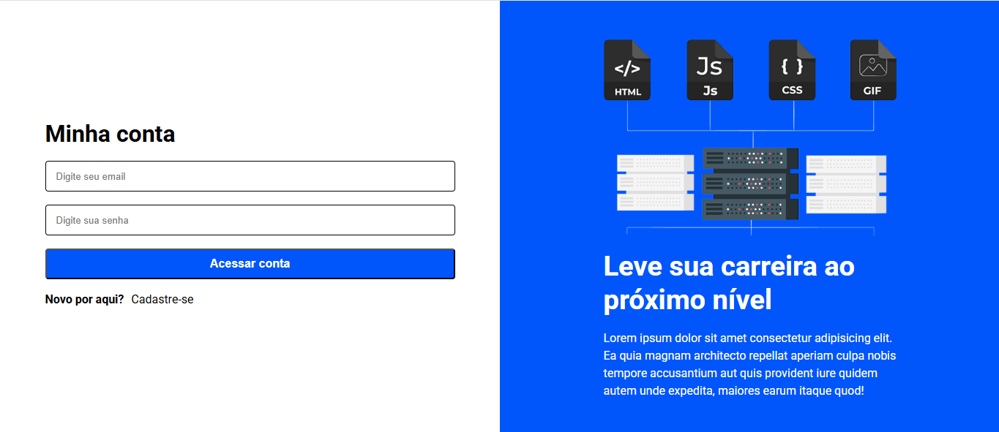

# 🚀 Tela de Cadastro Moderna

> Uma interface de usuário limpa e responsiva para cadastro de novas contas, projetada com foco em UI/UX.

---

## 💻 Sobre o Projeto

Este projeto é uma **landing page de cadastro** desenvolvida para praticar conceitos avançados de layout e estilização. 

A interface utiliza uma estrutura de duas colunas:
1.  **Formulário de Cadastro:** Com campos validados visualmente e foco na experiência do usuário.
2.  **Painel de Contexto:** Uma área visual que destaca tecnologias como HTML e CSS, reforçando a identidade do projeto.

---

## 📸 Preview

<p align="center">
  
</p>

---

## 🛠️ Tecnologias Utilizadas

* **HTML5:** Estrutura semântica dos elementos.
* **CSS3:** Layout (Flexbox) e estilização moderna.
* **Design Responsivo:** Adaptado para diferentes resoluções.

---x

## 🏁 Como Executar o Projeto

1.  **Clone o repositório:**
    ```bash
    git clone [https://github.com/gustavogoncalveslentz/projeto-pagina-de-cadastro.git](https://github.com/gustavogoncalveslentz/projeto-pagina-de-cadastro.git)
    ```
2.  **Abra o arquivo:**
    Navegue até a pasta e abra o arquivo `index.html` em seu navegador.

---

## 🎯 Funcionalidades

- [x] Design moderno e minimalista.
- [x] Campos de input estilizados.
- [x] Layout de duas colunas.

---

## ✒️ Autor

Desenvolvido por **Gustavo Gonçalves**.

* 🔗 **LinkedIn:** https://www.linkedin.com/in/gustavo-gon%C3%A7alves-lentz-6730591aa/
* 🐙 **GitHub:** https://github.com/gustavogoncalveslentz
